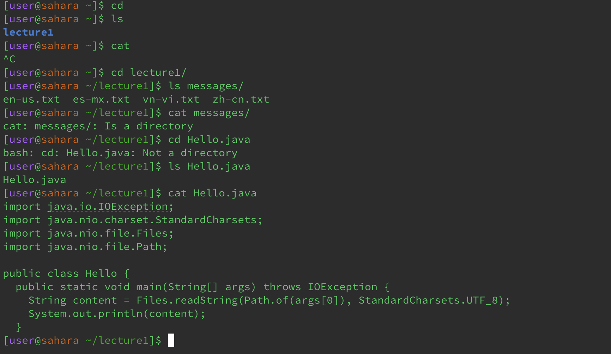

## Lab 1 Report
**For each of the commands `cd`, `ls`, and `cat`, and using the workspace you created in this lab:** 

# Examples
a) Share an example of using the command with no argument. 
```
[user@sahara ~]$ cd
[user@sahara ~]$ 
```
_The working directory is `/home`._\
_It seems like cd does not make any change without an argument. However, cd without an argument will change the current working directory to `/home`, which I already was, so nothing happened._\
_The output is not an error._
```
[user@sahara ~]$ ls
lecture1
```
_The working directory is `/home`._\
_ls will print all directories and files in the current working directory._\
_The output is not an error._
```
[user@sahara ~]$ cat

```
_The working directory is `/home`._\
_using cat without an argument, the cat command will read from standard input and write them to its standard output until it receives End Of File._\
_The output is not an error._\
b) Share an example of using the command with a path to a directory as an argument. 
```
[user@sahara ~]$ cd lecture1
[user@sahara ~/lecture1]$
```
_The working directory is `/home/lecture1`._\
_cd will change the current working directory to the argument (if valid/exist)._\
_The output is not an error._
```
[user@sahara ~/lecture1]$ ls messages 
en-us.txt  es-mx.txt  vn-vi.txt  zh-cn.txt
```
_The working directory is `/home/lecture1`._\
_ls will print all directories and files in the argument (if valid/exist)._\
_The output is not an error._
```
[user@sahara ~/lecture1]$ cat /home/lecture1
cat: /home/lecture1: Is a directory
```
_The working directory is `/home/lecture1`._\
_cat prints an error saying that the given argument is a directory._\
_The output is an error because lecture1 is a directory not a file and cat can only read from file._\
c) Share an example of using the command with a path to a file as an argument.
```
[user@sahara ~/lecture1]$ cd Hello.java
bash: cd: Hello.java: Not a directory
```
_The working directory is `/home/lecture1`._\
_cd prints an error saying that the given argument is not a directory._\
_The output is an error because lecture1 is a not a directory and cd can only go into directory not file._
```
[user@sahara ~/lecture1]$ ls Hello.java
Hello.java
```
_The working directory is `/home/lecture1`._\
_ls prints the file name._\
_The output is not an error._
```
[user@sahara ~/lecture1]$ cat Hello.java 
import java.io.IOException;
import java.nio.charset.StandardCharsets;
import java.nio.file.Files;
import java.nio.file.Path;

public class Hello {
  public static void main(String[] args) throws IOException {
    String content = Files.readString(Path.of(args[0]), StandardCharsets.UTF_8);    
    System.out.println(content);
  }
```
_The working directory is `/home/lecture1`._\
_cat prints all content in the file to the terminal._\
_The output is not an error._
# Output/Screenshots

