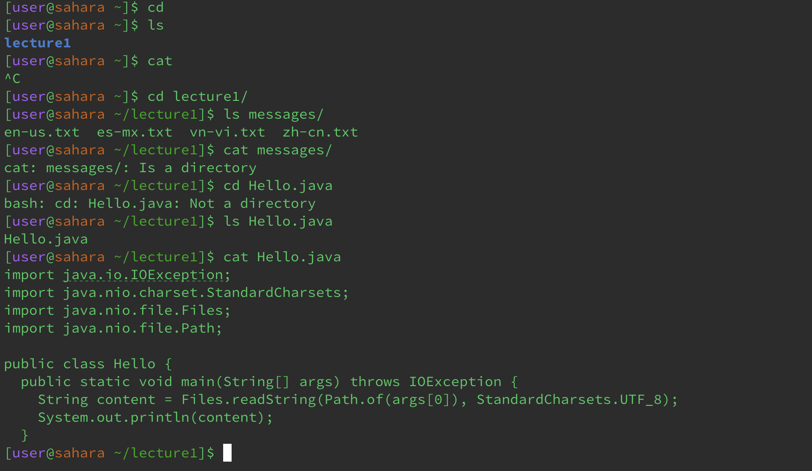

## Lab 1 Report
** For each of the commands cd, ls, and cat, and using the workspace you created in this lab:\ ** 

# Examples
a) Share an example of using the command with no argument.\
`[user@sahara ~]$ cd`\
_cd does not make any change without an argument._\
```
[user@sahara ~]$ ls
lecture1
```
_ls will print all directories and files in the current working directory._\
```
[user@sahara ~]$ cat

```
_cat will cause the terminal to continuously run unless forced to stop when use without an argument._\


b) Share an exmaple of using the command with a path to a directory as an argument.\
```
[user@sahara ~]$ cd lecture1
[user@sahara ~/lecture1]$
```
_cd will change the current working directory to given directory when cd is called_\
```
[user@sahara ~/lecture1]$ ls messages 
en-us.txt  es-mx.txt  vn-vi.txt  zh-cn.txt
```
_ls will print all directories and files in the given working directory._\
```
[user@sahara ~/lecture1]$ cat /home/lecture1
cat: /home/lecture1: Is a directory
```
_cat prints an error saying that the given argument is a directory._\


c) Share an example of using the command with a path to a file as an argument.\
```
[user@sahara ~/lecture1]$ cd Hello.java
bash: cd: Hello.java: Not a directory
```
_cd prints an error saying that the given argument is not a directory._\
```
[user@sahara ~/lecture1]$ ls Hello.java
Hello.java
```
_ls prints the file name._\
```
import java.io.IOException;
import java.nio.charset.StandardCharsets;
import java.nio.file.Files;
import java.nio.file.Path;

public class Hello {
  public static void main(String[] args) throws IOException {
    String content = Files.readString(Path.of(args[0]), StandardCharsets.UTF_8);    
    System.out.println(content);
  }
```
_cat prints all content in the file to the terminal._\

# Output/Screenshots

