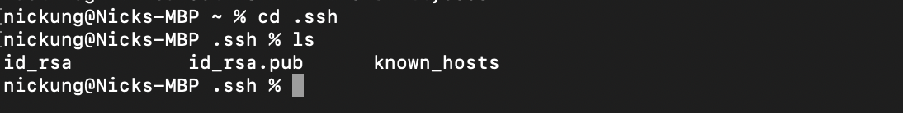
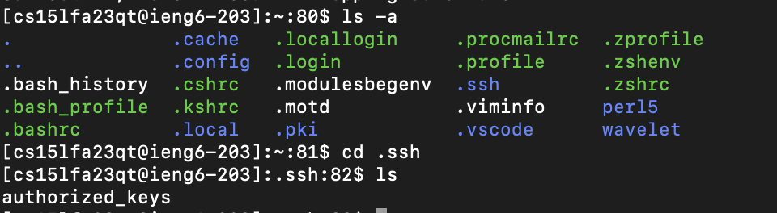

## Lab Report 2 - Servers and SSH Keys (Week 3)
## Part 1

Two methods are called when the page is accessed which are function handle from ServerHttpHandler class and handleRequest from Handler class.\
The relevant argument to these methods is the query as with and without a query will lead to different output on the server index page.\
\
Two methods are called when the page is accessed which are function handle from ServerHttpHandler class and handleRequest from Handler class.\
The relevant argument to these methods is the query as with and without a query will lead to different output on the server index page.\

## Part 2
a) The path to the private key for your SSH key for logging into ieng6 (on your computer or on the home directory of the lab computer)\
`/Users/nickung/.ssh`
\
b) The path to the public key for your SSH key for logging into ieng6 (within your account on ieng6)\
`/home/linux/ieng6/cs15lfa23/cs15lfa23qt/.ssh`
\
c) A terminal interaction where you log into ieng6 with your course-specific account without being asked for a password.

## Part 3
In a couple of sentences, describe something you learned from lab in week 2 or 3 that you didn’t know before.\
In week 3, I was able to learn that adding a . before the name of a file will make the file hidden. I believe this is useful to keep important files hidden preventing unwanted changes made to those files. In addition to that, the ls command can also take an argument namely -a that will show hidden files. Therefore, it is a great tool to see what is hidden.
